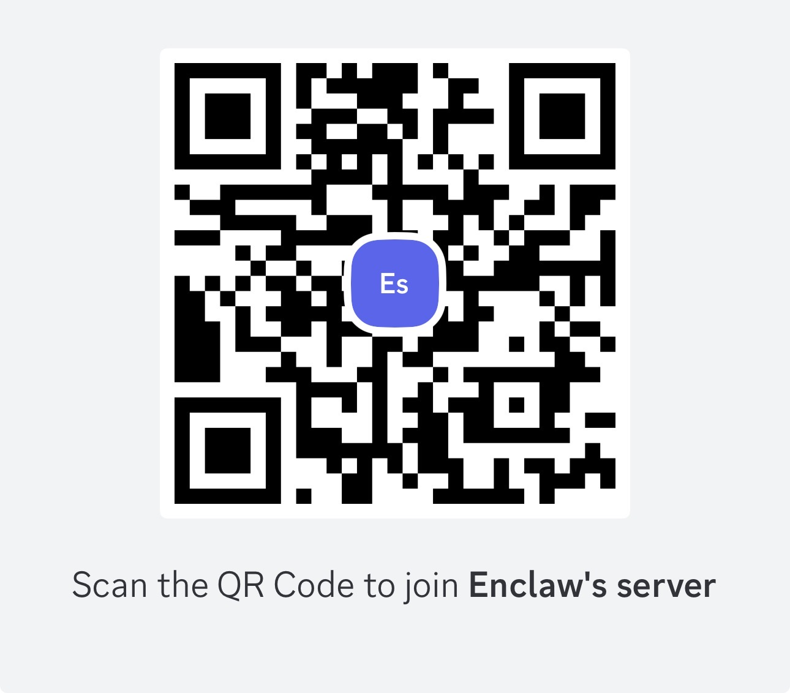

# EnClaws — Enterprise AI Assistant Container Platform

<p align="center">
  
</p>

<p align="center">
  English | <a href="./README.zh-CN.md">简体中文</a>
</p>

<p align="center">
  <strong>Turn AI from one person's tool into an enterprise operating capability.</strong>
</p>

<p align="center">
  <a href="https://github.com/hashSTACS/EnClaws/stargazers"></a>
  <a href="https://github.com/hashSTACS/EnClaws/issues"></a>
  <a href="./LICENSE"></a>
</p>

<p align="center">
  <a href="#quick-start-tldr">Quick start</a>
  ·
  <a href="#highlights">Highlights</a>
  ·
  <a href="#how-it-works-short">How it works</a>
  ·
  <a href="#community">Community</a>
  ·
  <a href="#license">License</a>
  ·
  <a href="#trademark">Trademark</a>
</p>

**EnClaws** is an **enterprise AI assistant container platform**. It is designed to create, schedule, isolate, upgrade, and audit large numbers of assistant instances across teams, workflows, and business systems.

Where OpenClaw focuses on the personal assistant experience, EnClaws focuses on the enterprise operating environment for digital assistants.

> [!IMPORTANT]
> This repository has just been opened. Additional deployment, configuration, and repository documentation will be published as the project expands.

## Why EnClaws exists

A personal assistant can be powerful for one person. An enterprise has a very different shape.

Enterprises need:

- boundaries between teams, departments, and users
- strict isolation for sensitive context and data
- memory that can exist at industry, company, department, and personal levels
- reusable skills that can spread across many assistants
- management surfaces for status, risk, cost, replay, and auditability
- a platform that can manage large numbers of digital assistants, not a single chat window

In short, enterprises do not just need a smarter assistant. They need a system that can run and govern a digital workforce.

## From OpenClaw to EnClaws

In the Claw world, the split is simple:

- **OpenClaw** is the personal claw. It is built around the experience of an individual assistant that belongs to one person.
- **EnClaws** is the enterprise claw. It is built to create, schedule, and manage large numbers of assistant instances so they can take on real work across an organization.

If OpenClaw is the personal operator, EnClaws is the enterprise operating environment.

## Quick start (TL;DR)

From the repository root:

```bash
git clone https://github.com/hashSTACS/EnClaws.git
cd EnClaws
docker-compose up -d
```

After the containers start, open the **Web management panel** and begin configuring your multi-user enterprise assistant environment.

> [!NOTE]
> The current public documentation covers the minimal bootstrap command above plus the presence of a Web management panel. Additional setup details will be added as they are published.

<p align="center">
  
</p>

## Highlights

- **One assistant, many concurrent tasks**  
  EnClaws is designed for concurrent execution. A finance assistant should be able to process reimbursement requests for many employees in parallel instead of becoming a single-file queue.

- **Native multi-user isolation**  
  The platform is built for multi-user environments from the start, with isolated context, memory, and execution boundaries for each user.

- **Hierarchical memory**  
  Enterprise assistants can reason across multiple layers of knowledge at once: industry memory, company memory, department memory, and personal memory.

- **Memory distillation and upgrade**  
  Valuable experience is not meant to remain trapped inside raw logs. It can be captured, distilled into reusable capability artifacts, reviewed, and promoted upward when appropriate.

- **Skill sharing and propagation**  
  A strong skill used by one assistant should not stay trapped in one assistant. EnClaws is designed to expose, share, and propagate skills across assistants.

- **Audit and state monitoring**  
  Managers need visibility. EnClaws is intended to surface assistant status, task execution, token cost signals, risk signals, and replayable evidence.

- **A2A Collaboration as a roadmap direction**  
  Lightweight assistant-to-assistant collaboration is part of the forward direction for EnClaws, with an emphasis on lower token overhead and more efficient data exchange.

## Core capability model

### 1) One assistant, many concurrent tasks

Unlike a serial assistant that waits for one instruction to finish before the next begins, EnClaws is designed to support concurrent task execution.

This matters in enterprise workloads. A finance assistant should be able to handle many reimbursement requests at the same time, instead of making every employee stand in the same digital queue.

The design goal is not just speed. It is stable, responsive enterprise service behavior under sustained multi-user demand.

### 2) Native multi-user mode

EnClaws is built for multi-user operation from the start.

That means:

- the runtime can distinguish users and execution contexts
- each user can have isolated memory and personalized behavior
- sensitive information is prevented from bleeding across people, teams, or departments

The point is not only convenience. It is operational safety.

### 3) Hierarchical memory management

Enterprise work rarely belongs to one flat context window.

EnClaws is designed around a layered memory model so assistants can work with multiple kinds of knowledge at once:

- **Industry memory** for public rules, terms, and regulations
- **Company memory** for business model, policies, culture, and shared product knowledge
- **Department memory** for playbooks, workflows, and collaboration rules
- **Personal memory** for individual habits, preferences, and historical context

This is not one giant mixed brain. It is structured organizational memory.

### 4) Memory distillation and upgrade

EnClaws is not meant to blindly synchronize raw memory everywhere.

Instead, the goal is to identify valuable experience, distill it into reusable capability artifacts, review it for desensitization and compliance, and then promote it upward from the personal or team level to department or company scope.

That turns learning into organizational evolution instead of duplicated rework.

### 5) Skill sharing and automatic propagation

A good enterprise platform should let capability travel.

EnClaws is designed around a standardized skill-sharing model so that a skill proven useful in one assistant can be exposed, reused, and propagated to others.

One assistant learning something useful should make the whole system better.

### 6) Audit and state monitoring

The more capable digital assistants become, the more important observability becomes.

EnClaws is intended to provide a management-facing view of:

- assistant state
- executed instructions
- risk signals
- token consumption and cost visibility
- replayable process, evidence, and responsibility chains

This is how a digital workforce becomes governable instead of mysterious.

### 7) Assistant collaboration as a roadmap direction

A2A Collaboration is part of the forward direction for EnClaws.

The aim is a lightweight inter-container collaboration model where many coordination instructions can be completed through direct protocol exchange rather than repeated full-model interpretation.

That means:

- lower token consumption
- more efficient shared data flow
- multi-assistant cooperation that behaves more like a coordinated team

This belongs in the roadmap section because it is a direction, not a launch-day overclaim.

## How it works (short)

```text
Users / Teams / Enterprise Systems
                 │
                 ▼
   Assistant Runtime + Control Plane
                 │
      ┌──────────┼──────────┬──────────┐
      ▼          ▼          ▼          ▼
 Concurrency   Memory      Skills    Audit
                 │
                 ▼
      Web management panel and enterprise surfaces
```

A slightly more detailed mental model:

```text
Enterprise users + business systems + work events
                      │
                      ▼
      containerized assistant runtime and scheduler
                      │
          ┌───────────┼───────────┬───────────┐
          ▼           ▼           ▼           ▼
     isolation     memory      skills    monitoring
                      │
                      ▼
           evidence, replay, operations, action
```

## North Star

EnClaws is not trying to become only a fancier AI toy.

It is also not trying to become only an abstract substrate that a tiny circle of architects can understand.

Its north star is to gradually turn **how enterprises operate** into an **open, collaborative, and evolvable AI system**.

## Join us

EnClaws aims to help define the foundation layer for AI in real enterprise workflows.

If you want AI to move from demos into business operations:

- star the repository
- open issues with concrete operator needs
- participate in Skill Spec and runtime discussions
- help make enterprise AI more reproducible, governable, and shareable

## Credits & acknowledgements

EnClaws stands on the shoulders of open-source giants. We gratefully acknowledge:

- **[openclaw/openclaw](https://github.com/openclaw/openclaw)**  
  The personal assistant foundation that helped define a strong digital assistant paradigm. EnClaws extends that line of thinking toward enterprise-scale containerized operation.

- **[luolin-ai/openclawWeComzh](https://github.com/luolin-ai/openclawWeComzh)**  
  Valuable reference work for Enterprise WeCom adaptation and the multi-tenant enterprise IM integration layer.

We remain committed to an open-contract spirit and to improving enterprise AI runtime standards together with the open-source community.

## Community

- See **[CONTRIBUTING.md](./CONTRIBUTING.md)** for contribution guidelines.
- See **[GOVERNANCE.md](./GOVERNANCE.md)** for project decision-making and maintainer expectations.
- See **[CODE_OF_CONDUCT.md](./CODE_OF_CONDUCT.md)** for community standards.
- See **[SECURITY.md](./SECURITY.md)** for vulnerability reporting.
- See **[TRADEMARK.md](./TRADEMARK.md)** for brand usage rules.

### Join the EnClaws community

Stay close to releases, operator feedback, and product discussion:

- Feishu group: [Join via link](https://applink.feishu.cn/client/chat/chatter/add_by_link?link_token=1b6r1c67-a833-4d36-b748-5e6729d65045)
- Discord server: [Join via invite](https://discord.gg/p4Kp5jKAsZ)

<p align="center">
  <a href="https://applink.feishu.cn/client/chat/chatter/add_by_link?link_token=1b6r1c67-a833-4d36-b748-5e6729d65045">
    
  </a>
  <a href="https://discord.gg/p4Kp5jKAsZ">
    
  </a>
</p>

<p align="center">
  <a href="https://applink.feishu.cn/client/chat/chatter/add_by_link?link_token=1b6r1c67-a833-4d36-b748-5e6729d65045"><strong>Join on Feishu</strong></a>
  ·
  <a href="https://discord.gg/p4Kp5jKAsZ"><strong>Join on Discord</strong></a>
</p>

## License

Licensed under **Apache License 2.0**. See **[LICENSE](./LICENSE)**.

## Trademark

The source code is open under Apache License 2.0, but the project names, logos, and brand identifiers are reserved.

Apache License 2.0 does **not** grant trademark rights. For permitted and prohibited brand usage, see **[TRADEMARK.md](./TRADEMARK.md)**.
